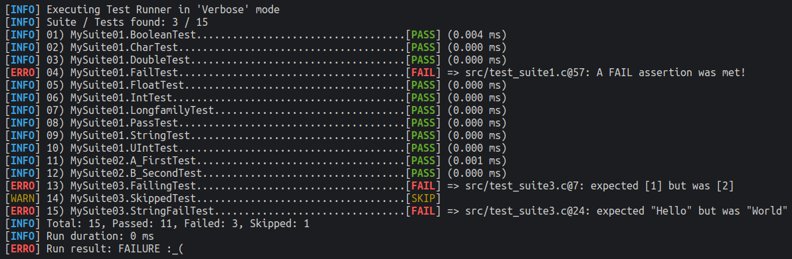

# CLove-Unit  &middot; [](./clove-unit.h) [](https://github.com/fdefelici/clove-unit/actions/workflows/ci_action.yml) [](https://conan.io/center/clove-unit)
`CLove-Unit` is a unit testing single-header library for C (mainly, but could also work with C++), with test autodiscovery feature.

The aim of this library is to reduce at the minimum the boilder-plate for C developers and just focus on unit test development (such as avoiding to register manually the tests to an execution list).

`CLove-Unit` is able to discover and run your tests, gathering information about positives and failures (file, line, reason), with a colored syntax (if ANSI is supported by your shell).



# Features
Here a list of features provided by `CLove-Unit`:
* Single Header
* Tests Autodiscovery (reducing at minimum developer boiler-plate on writing tests)
* Console Report in ANSI format (if supported by the shell)
* Tests / Run duration
* Tests / Run failure pointing to the file/line where the assertions are unsatisfied
* Selective test execution (opportunity to include/exclude tests from the execution)

# IDE Extension
For the one, who prefer UI oriented test executor, `CLove-Unit` is supported on the following IDEs:
* `Visual Studio Code`:  Extension is available from the [VSCode Market Place](https://marketplace.visualstudio.com/items?itemName=fdefelici.vscode-clove-unit). 

Have a look and enjoy ;-)

# Supported Package Managers
`CLove-Unit` is also available on the following Package Managers:
* [Conan](https://conan.io/center/clove-unit)

# How it works
`CLove-Unit` is implemented around the following concepts:
- **Test**: a test is basically a fuction where you can stimulate your code and validate it using assertion
- **Suite**: a suite is a set of Tests to be run. A Suite allow to execute setup/teardown behaviour for each Test execution (or once for all the Tests).
- **Runner**: a runner allow execution of a set of Suites and provide results

> `CLove-Unit` tests discovery works parsing the symbol table in the test executable. 
>
> At the moment this feature is available for the following OS / Architecture / Executable Format:
> - Windows / 32-64 bit little-endian / PE (Portable Executable)
> - MacOS / 64 bit little-endian / Mach-o (Mach Object)
> - Linux / 64 bit little-endian / ELF (Executable and Linkable Format)
> 
> Further compatibilities in terms of OS, Architecture and Format can be implement later on as needed.

# Usage
Just add [clove-unit.h](./clove-unit.h) header in your project and starts creating unit tests for your code base as follow:

First define a Suite name and then implement related test cases:

```c
//file test_suite1.c
#define CLOVE_SUITE_NAME MySuite01
#include "clove-unit.h"

CLOVE_TEST(FirstTest) {
    int a = 1;
    int b = 1;
    CLOVE_INT_EQ(a, b);
}

CLOVE_TEST(SecondTest) {
    CLOVE_IS_TRUE(1);
}
```

Then setup a translation unit to be the main program with autodiscovery feature.

Using `CLOVE_IMPLEMENTATION` definition **once** before `clove-unit.h` will include whole library implementation.

```c
//file main.c
#define CLOVE_IMPLEMENTATION
#include "clove-unit.h"

CLOVE_RUNNER()
```

Finally, build and run the test executable and `CLove-Unit` will do the magic :-)


> Look at the [example](./examples/clove101) project for samples about:
> - implement clove suites and tests
> - assertion usage ([test_suite1.c](./examples/clove101/test_suite1.c))
> - suite setup & tear down feature ([test_suite2.c](./examples/clove101/test_suite2.c))

# Development Apis
Here a list of availables apis to support test development.

## Library Configuration
Apis to be used for the very base setup of the library.

| Api | Description |
| ------------- | ------------- |
| CLOVE_IMPLEMENTATION | macro to be declared just once before `clove-unit.h` will include whole library implementation |
| CLOVE_RUNNER()  | generate program entry point  |


## Test Definition
Apis to be used for defining suite and tests.

| Api | Description |
| ------------- | ------------- |
| CLOVE_SUITE_NAME  | Macro to be defined for each suite, before including clove header |
| CLOVE_SUITE_SETUP_ONCE()  | Implement a procedure to be executed only once before all the test cases (Optional) |
| CLOVE_SUITE_TEARDOWN_ONCE()  | Implement a procedure to be executed only once after all the test cases (Optional) |
| CLOVE_SUITE_SETUP()  | Implement a procedure to be executed before each test case (Optional) |
| CLOVE_SUITE_TEARDOWN()  | Implement a procedure to be executed after each test case (Optional) |
| CLOVE_TEST(name)  | Define test case named "name" |

## Test Assertions
Assertions that can be used within a ```CLOVE_TEST``` definition.

| Api | Description |
| ------------- | ------------- |
| CLOVE_PASS()  | Assertion that always make the test pass |
| CLOVE_FAIL()  | Assertion that always make the test fail |
| CLOVE_IS_TRUE(result)  | Check if int is not 0 |
| CLOVE_IS_FALSE(result)  | Check if int is 0 |
| CLOVE_CHAR_EQ(expected, result)  | Check equality between char |
| CLOVE_CHAR_NE(expected, result)  | Check inequality between char |
| CLOVE_INT_EQ(expected, result)  | Check equality between int |
| CLOVE_INT_NE(expected, result)  | Check inequality between int |
| CLOVE_UINT_EQ(expected, result)  | Check equality between unsigned int |
| CLOVE_UINT_NE(expected, result)  | Check inequality between unsigned int |
| CLOVE_LONG_EQ(expected, result)  | Check equality between long |
| CLOVE_LONG_NE(expected, result)  | Check inequality between long |
| CLOVE_ULONG_EQ(expected, result)  | Check equality between unsigned long |
| CLOVE_ULONG_NE(expected, result)  | Check inequality between unsigned long |
| CLOVE_LLONG_EQ(expected, result)  | Check equality between long long |
| CLOVE_LLONG_NE(expected, result)  | Check inequality between long long |
| CLOVE_ULLONG_EQ(expected, result)  | Check equality between unsigned long long |
| CLOVE_ULLONG_NE(expected, result)  | Check inequality between unsigned long long |
| CLOVE_FLOAT_EQ(expected, result)  | Check equality between float |
| CLOVE_FLOAT_NE(expected, result)  | Check inequality between float |
| CLOVE_DOUBLE_EQ(expected, result)  | Check equality between double |
| CLOVE_DOUBLE_NE(expected, result)  | Check inequality between double |
| CLOVE_STRING_EQ(expected, result)  | Check equality between string (null terminated char pointer or array) |
| CLOVE_STRING_NE(expected, result)  | Check inequality between string (null terminated char pointer or array) |
| CLOVE_NULL(result)  | Check if result is NULL |
| CLOVE_NOT_NULL(result)  | Check if result is not NULL |
| CLOVE_PTR_EQ(expected, result)  | Check equality between pointers |
| CLOVE_PTR_NE(expected, result)  | Check inequality between pointers |


## Test Helper
Helper apis to support test implementation
| Api | Description |
| ------------- | ------------- |
| CLOVE_EXEC_PATH()  | Macro to easily retrive executable path as a char* |
| CLOVE_EXEC_BASE_PATH() | Macro to easily retrive executable base path a char* |

# Console Apis
Commandline options supported by the binary produced by a `CLove-Unit` test project compilation.


| Command line | Description |
| ------------- | ------------- |
| \<exec\>  | Running executable with no args will produce a verbose console report |
| \<exec\> -i `SELECT_PATTERN` | include tests to be executed by the runner <br /> (optional argument, can be repeated more than once) |
| \<exec\> -e `SELECT_PATTERN` | exclude tests to be executed by the runner  <br /> (optional argument, can be repeated more than once) |

> NOTE: If both -i and -e options are provided, the inclusion pattern always wins over the exclusion one.

The `SELECT_PATTERN` works as follow:
* Basic: `SuiteName.TestName`
* Wildcard: Only `*` is supported, and can be used to implement pattern such as "start with", "end with", "contains", "all", for both the SuiteName and TestName

So for instance the following are valids select patterns (non-exhaustive list):
| Pattern Example | Description |
| ------------- | ------------- |
| MySuite01.Test01 | will match exactly the Suite Name and the Test Name |
| MySuite01 | will match all tests whose Suite Name is "MySuite01" |
| Suite\* | will match all tests whose Suite Name starts with "Suite" |
| \*Suite01 | will match all tests whose Suite Name ends with "Suite01" |
| \*Suite\* | will match all tests whose Suite Name contains "Suite" |
| \*Suite\* | will match all tests whose Suite Name contains "Suite" |
| MySuite01.*01 | will match all tests whose Suite Name is MySuite01 and Test Name ends with "01" |
| \*.\* | will match all suites and tests |


