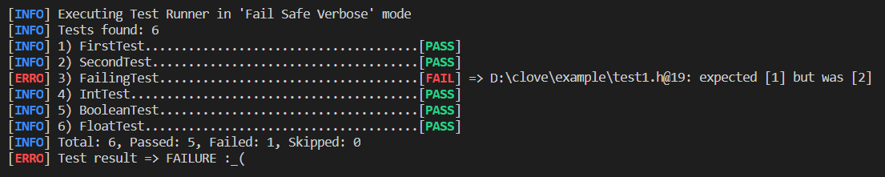

# Clove
Clove is a unit testing single-header library for C.

Run your tests gathering information about positives and failures (file, line, reason), with a colored syntax (if supported by your shell).




# How it works
The library is implemented around the following concepts:
- **Test**: a test is basically a fuction where you can stimulate your code and validate it using assertion
- **Suite**: a suite is a set of Tests to be run. A Suite allow to execute setup/teardown behaviour for each Test execution.
- **Runner**: a runner allow execution of a set of Suites and provide results

# Usage
Just add [clove.h](./clove.h) header in your project and starts creating unit test for your code as follow.

First define a Suite and related test cases:
```c
//file test_suite1.h
#include "clove.h"

CLOVE_TEST(FirstTest) {
    int a = 1;
    int b = 1;
    CLOVE_INT_EQ(a, b);
}

CLOVE_TEST(SecondTest) {
    CLOVE_IS_TRUE(1);
}

CLOVE_SUITE(TestSuite1) {
    CLOVE_SUITE_TESTS(
        FirstTest, 
        SecondTest
    );
}
```

Than include the test suite files in the one that will be the main program and explict Suites to be run:

```c
//file main.c
#include "clove.h"
#include "test_suite1.h"
#include "test_suite2.h"

CLOVE_RUNNER(TestSuite1, TestSuite2)
```

> Look at the [example](./example) project for sample about:
> - assertion usage ([test_suite1.h](./example/test_suite1.h), [test_suite2.h](./example/test_suite2.h))
> - suite setup & tear down ([test_suite3.c](./example/test_suite3.c))
> - working with traslation unit instead of just put everything in header files ([test_suite3.c](./example/test_suite3.c)).

# Apis
Here a list of availables apis
## Test Definition
Apis to be used for defining tests.
| Api | Description |
| ------------- | ------------- |
| CLOVE_RUNNER(...)  | List test suites to run (implemented with CLOVE_SUITE) and generate program entry point  |
| CLOVE_SUITE(name)  | Define test suite named "name" |
| CLOVE_SUITE_DECL(name)  | Forward declaring a suite named "name" (Optional) |
| CLOVE_SUITE_SETUP(func_name)  | Assign a function `void func_name()` to be executed before each test case (Optional. To be used within CLOVE_SUITE(Name) block) |
| CLOVE_SUITE_TEARDOWN(func_name)  | Assign a function `void func_name()` to be executed after each test case (Optional. To be used within CLOVE_SUITE(Name) block) |
| CLOVE_SUITE_TESTS(...)  | Assign a list of test defined with ```CLOVE_TEST(Name)``` to the suite (To be used within ```CLOVE_SUITE(Name)``` block) |
| CLOVE_TEST(Name)  | Define test case named "Name" |


## Test Assertions
Assertions that can be used within a ```CLOVE_TEST```

| Api | Description |
| ------------- | ------------- |
| CLOVE_PASS()  | Assertion that always make the test pass |
| CLOVE_FAIL()  | Assertion that always make the test fail |
| CLOVE_CHAR_NE(expected, result)  | Check inequaliy between char |
| CLOVE_CHAR_EQ(expected, result)  | Check equality between char |
| CLOVE_CHAR_NE(expected, result)  | Check inequaliy between char |
| CLOVE_INT_EQ(expected, result)  | Check equality between int |
| CLOVE_INT_NE(expected, result)  | Check inequaliy between int |
| CLOVE_IS_TRUE(result)  | Check if int is not 0 |
| CLOVE_IS_FALSE(result)  | Check if int is 0 |
| CLOVE_FLOAT_EQ(expected, result)  | Check equality between float |
| CLOVE_FLOAT_NE(expected, result)  | Check inequaliy between float |
| CLOVE_STRING_EQ(expected, result)  | Check equality between string (null terminated char pointer or array) |
| CLOVE_STRING_NE(expected, result)  | Check inequaliy between string (null terminated char pointer or array) |
| CLOVE_NULL(result)  | Check if result is NULL |
| CLOVE_NOT_NULL(result)  | Check if result is not NULL |
| CLOVE_PTR_EQ(expected, result)  | Check equality between pointers |
| CLOVE_PTR_NE(expected, result)  | Check inequaliy between pointers |


## Test Helper
Helper apis to support test implementation
| Api | Description |
| ------------- | ------------- |
| CLOVE_EXEC_PATH  | Macro to easily retrive executable path |
| CLOVE_EXEC_BASE_PATH  | Macro to easily retrive executable base path |
